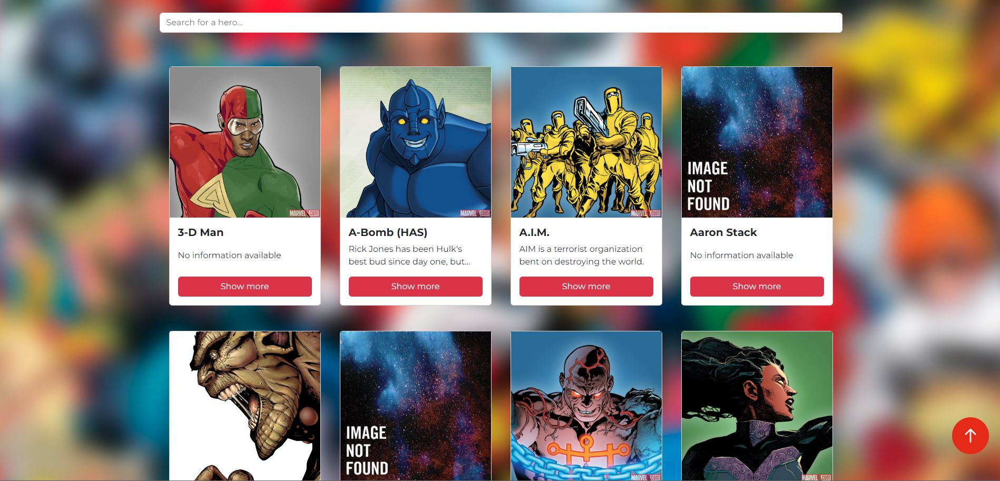
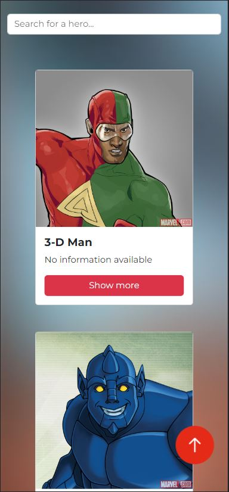

# Aplicación de búsqueda de superhéroes
Esta es una aplicación de búsqueda de superhéroes creada con Angular y que utiliza la API de SuperheroAPI para obtener información sobre los superhéroes.

## Cómo iniciar el proyecto
Para iniciar el proyecto, sigue los siguientes pasos:

- Abre una terminal y accede al directorio del proyecto.
- Ejecuta el comando ``npm install`` para instalar las dependencias necesarias.
- Ejecuta el comando ``npm start`` para iniciar la aplicación.

## Funcionamiento de la aplicación
La aplicación consta de un grid principal que muestra cards de los superhéroes. A medida que se hace scroll, se irán mostrando más tarjetas. 
La aplicación también cuenta con un buscador en la parte superior que permite buscar un superhéroe en base a la cadena introducida en el input.

Al hacer clic en cada tarjeta, se abre un modal con información adicional sobre el superhéroe. Desde este modal, es posible redirigir a una página con más información sobre las apariciones del superhéroe.

## Información adicional
### Responsivo
La aplicación es totalmente responsiva y se adapta a todos los tamaños de pantalla. Puedes usarla en cualquier dispositivo sin problemas.

